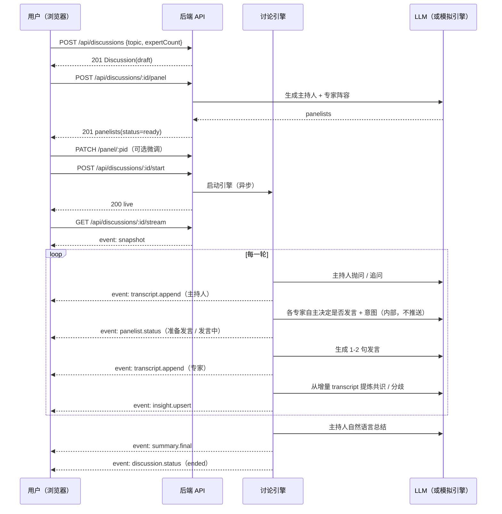
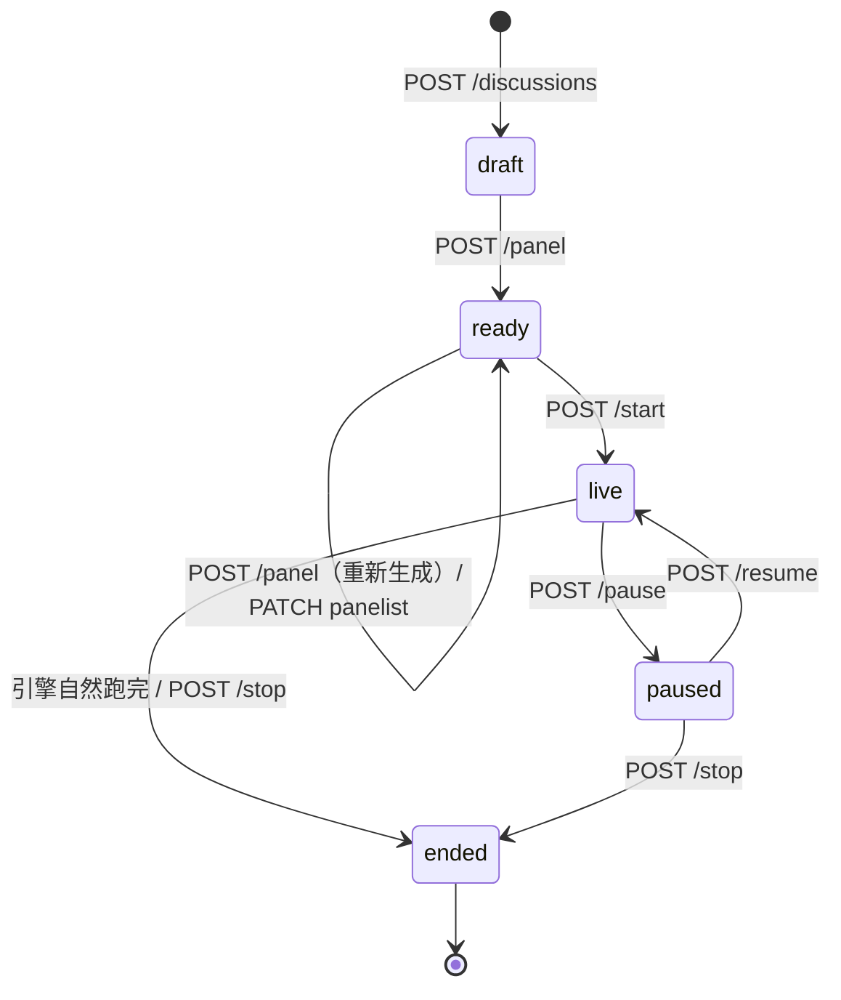

# AI Panel Studio · API 契约

Base URL：`http://localhost:8787` ｜ 全部为 JSON（SSE 除外）｜ 前端开发时经 Vite 代理为同源 `/api/*`

> 大模型 API Key 只存在于后端进程的环境变量中。前端不持有、也无法请求到任何密钥。

## 1. 通用约定

**错误响应**

```json
{ "error": { "code": "DISCUSSION_NOT_FOUND", "message": "讨论不存在" } }
```

| HTTP | code | 含义 |
| --- | --- | --- |
| 400 | `VALIDATION_ERROR` | 请求参数不合法（附带 `details`） |
| 404 | `NOT_FOUND` | 讨论 / 嘉宾不存在 |
| 409 | `INVALID_STATE` | 当前状态不允许该操作（如对已结束的讨论调用 start） |
| 500 | `INTERNAL_ERROR` | 服务端异常 |

**核心资源形状**

```ts
type DiscussionStatus = 'draft' | 'ready' | 'live' | 'paused' | 'ended';
type Phase = 'opening' | 'exploration' | 'conflict' | 'convergence' | 'closing' | 'done';

interface Discussion {
  id: string;
  topic: string;
  background: string | null;
  expertCount: number;
  status: DiscussionStatus;
  phase: Phase;
  round: number;
  maxTurns: number;
  summary: string | null;
  createdAt: number;
  startedAt: number | null;
  endedAt: number | null;
}

interface Panelist {
  id: string;
  discussionId: string;
  role: 'host' | 'expert';
  name: string;
  title: string;
  org: string | null;
  stance: string;
  bio: string;
  color: string;              // hex，同讨论内唯一
  status: 'idle' | 'ready' | 'speaking' | 'thinking';
  focus: string | null;       // 公开的当前关注点，非隐藏 CoT
  orderIndex: number;
}

interface TranscriptEntry {
  id: string;
  discussionId: string;
  panelistId: string;
  seq: number;
  round: number;
  phase: Phase;
  intent: 'open' | 'question' | 'claim' | 'rebuttal' | 'supplement' | 'agree' | 'summary';
  content: string;
  createdAt: number;
}

interface Insight {
  id: string;
  discussionId: string;
  kind: 'consensus' | 'divergence';
  statement: string;
  supporterIds: string[];
  tension: string | null;
  status: 'emerging' | 'stable';
  round: number;
  createdAt: number;
  updatedAt: number;
}

interface DiscussionDetail extends Discussion {
  panelists: Panelist[];
  transcript: TranscriptEntry[];
  insights: Insight[];
  lastSeq: number;
}
```

---

## 2. 接口清单

### 2.1 健康检查

`GET /api/health`

```json
{
  "status": "ok",
  "llm": { "provider": "deepseek", "model": "deepseek-chat", "mock": true },
  "now": 1790123456789
}
```

`mock: true` 表示当前未配置 API Key，走内置模拟引擎。

---

### 2.2 预置议题库（样例数据）

`GET /api/preset-topics`

返回 5+ 条预置议题，用于首页「一键体验」。

```json
{
  "items": [
    {
      "id": "ai-education",
      "topic": "AI 是否会取代中小学教师？",
      "background": "面向 K12 场景，需兼顾教学效果与教育公平",
      "expertCount": 4,
      "tags": ["教育", "AI 伦理"],
      "suggestedPanel": [
        { "name": "沈亦舟", "title": "教育技术学教授", "stance": "技术是放大器，不改变教育本质" }
      ]
    }
  ]
}
```

---

### 2.3 讨论列表（首页）

`GET /api/discussions?status=live|ready|ended|all&limit=50`

```json
{
  "items": [
    {
      "id": "d-8f3a2c",
      "topic": "远程办公是否会削弱团队创新能力？",
      "status": "live",
      "phase": "conflict",
      "round": 3,
      "expertCount": 4,
      "panelistCount": 5,
      "entryCount": 14,
      "consensusCount": 2,
      "divergenceCount": 3,
      "preview": "张临风：异步沟通降低了偶发碰撞……",
      "createdAt": 1790123000000,
      "startedAt": 1790123100000,
      "endedAt": null,
      "palette": ["#E7B24A", "#5FB3C9", "#C97BB0", "#8FBF6A", "#D9885F"]
    }
  ]
}
```

`palette` 为该讨论嘉宾颜色，用于首页卡片快速识别。

---

### 2.4 创建讨论（生成议题草稿）

`POST /api/discussions`

```json
{ "topic": "远程办公是否会削弱团队创新能力？", "background": "面向 200 人规模的软件团队", "expertCount": 4 }
```

约束：`topic` 2–200 字；`background` ≤ 500 字；`expertCount` 2–6。

**响应** `201` → `Discussion`（`status: 'draft'`）

---

### 2.5 生成 / 重新生成阵容

`POST /api/discussions/:id/panel`

调用大模型动态生成 **1 名主持人 + expertCount 名专家**。响应 `201`：

```json
{ "discussionId": "d-8f3a2c", "status": "ready", "panelists": [ /* Panelist[]，host 在首位 */ ] }
```

幂等：重复调用会覆盖旧阵容（`draft` / `ready` 状态下允许）。`live` 状态下返回 `409 INVALID_STATE`。

---

### 2.6 微调单个嘉宾

`PATCH /api/discussions/:id/panel/:panelistId`

允许用户确认前微调姓名 / Title / 立场 / 颜色。

```json
{ "name": "张临风", "title": "组织行为学教授", "stance": "…", "color": "#5FB3C9" }
```

**响应** `200` → `Panelist`。仅在 `draft` / `ready` 状态允许。

---

### 2.7 开始讨论

`POST /api/discussions/:id/start`

用户确认阵容后调用。后端启动讨论引擎（异步），并立即返回。

```json
{ "id": "d-8f3a2c", "status": "live", "phase": "opening", "round": 0 }
```

**响应** `200`。仅 `ready` 状态允许，否则 `409`。

---

### 2.8 暂停 / 继续 / 结束

| 方法 | 路径 | 说明 |
| --- | --- | --- |
| `POST` | `/api/discussions/:id/pause` | 暂停引擎推进，`status → paused` |
| `POST` | `/api/discussions/:id/resume` | 恢复推进，`status → live` |
| `POST` | `/api/discussions/:id/stop` | 结束讨论，主持人产出自然语言总结，`status → ended` |

`stop` 响应：`{ "id": "d-8f3a2c", "status": "ended", "summary": "……" }`

---

### 2.9 讨论详情（回放 / 中途加入）

`GET /api/discussions/:id`

**响应** `200` → `DiscussionDetail`（含 `panelists` / `transcript` / `insights` / `lastSeq`）

`GET /api/discussions/:id/transcript?since=<seq>` → `{ "items": TranscriptEntry[], "lastSeq": number }`

---

### 2.10 删除讨论

`DELETE /api/discussions/:id` → `204`

---

## 3. SSE 实时流

`GET /api/discussions/:id/stream?since=<seq>`

- `Content-Type: text/event-stream`
- 连接建立后**先推一条 `snapshot`**（完整当前状态），随后按 `seq` 增量推送。
- 带 `since` 时先回放 `seq > since` 的历史事件，再转入实时。
- 每 15s 发送 `heartbeat` 注释帧保活。

**事件格式**

```
id: 14
event: transcript.append
data: {"seq":14,"type":"transcript.append","discussionId":"d-8f3a2c","ts":1790123456789,"payload":{...}}
```

**事件类型**

| type | payload | 说明 |
| --- | --- | --- |
| `snapshot` | `DiscussionDetail` | 连接建立时的完整状态 |
| `discussion.status` | `{ status, phase, round }` | 讨论生命周期 / 阶段 / 轮次变化 |
| `panelist.status` | `{ panelistId, status, focus }` | 某位嘉宾的运行状态与关注点变化 |
| `transcript.append` | `{ entry: TranscriptEntry }` | 新增一条发言 |
| `insight.upsert` | `{ insight: Insight }` | 新增或更新一条共识 / 分歧 |
| `summary.final` | `{ summary }` | 主持人最终总结（自然语言） |
| `error` | `{ message }` | 引擎异常（讨论会被标记为 `ended`） |
| `heartbeat` | `{}` | 保活 |

**注意**：`panelist.status` 的 `focus` 是**对外可见的关注点摘要**，不是模型隐藏的推理链；`transcript.append` 也不会推送「举手 / 抢答」这类内部决策事件——这些只影响发言顺序，不出现在事件流中。

---

## 4. 讨论引擎时序



## 5. 状态机


