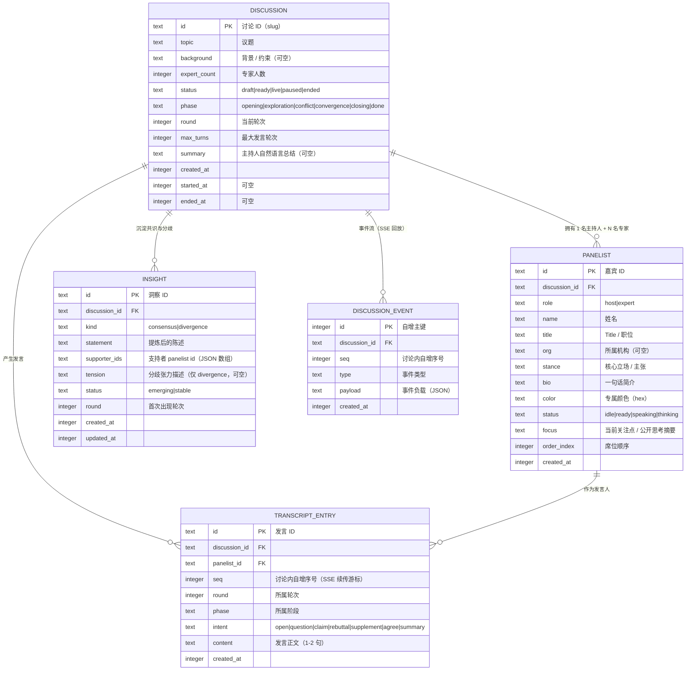

# AI Panel Studio · 数据模型与 ER 图

存储：**SQLite**（单文件，随项目本地运行）。所有时间字段为 Unix 毫秒时间戳（INTEGER），结构化字段使用 TEXT 存 JSON 字符串。

## 1. ER 图

## 2. 实体与约束说明

### DISCUSSION（讨论）
一场圆桌讨论的聚合根。`status` 描述生命周期，`phase` 描述讨论内容的推进阶段，两者正交。

- `status`：`draft`（已建议题、未生成阵容）→ `ready`（阵容已生成、待确认）→ `live`（进行中）→ `paused` → `ended`。
- `phase`：`opening`（主持人开场）→ `exploration`（观点铺开）→ `conflict`（正面交锋）→ `convergence`（收敛共识）→ `closing`（主持人总结）→ `done`。
- 同一议题可以创建多场讨论，互不影响。

### PANELIST（嘉宾）
每场讨论固定 **1 名主持人 + N 名专家**（N 默认 4，允许 2–6）。

- `role = 'host'` 的主持人不参与观点表态，只负责开场、追问、串联、收尾。
- `color` 由生成器分配，同一讨论内唯一，是嘉宾在 UI 中的身份标识（状态灯 / 发言色块 / 共识分歧标签三处复用）。
- `focus` 是对外可见的「当前关注点」，**不是**模型隐藏的 chain-of-thought。

### TRANSCRIPT_ENTRY（发言记录）
- `seq` 在讨论内单调自增，既是展示顺序，也是 SSE 断线续传游标。
- `intent` 记录这条发言在讨论中的语用角色，用于前端着色与共识提炼的输入。
- 每次发言正文限制在 1–2 句，由 prompt 约束 + 后端截断双重保证。

### INSIGHT（共识 / 分歧）
- `kind = 'consensus'`：多方明确认同的结论。
- `kind = 'divergence'`：尚未解决的对立观点，`tension` 描述对立点。
- `status = 'emerging'` 表示仍在形成中，`stable` 表示已稳定；用于前端区分「正在形成」与「已确立」。
- 由 `synthesizer` 在每个轮次结束后增量更新（新增或更新 supporter 集合），而不是讨论结束才生成。

### DISCUSSION_EVENT（事件流）
append-only 的事件日志。SSE 连接建立时按 `seq` 回放，保证「中途加入」和「断线重连」都能拿到完整状态。

## 3. 索引

| 表 | 索引 | 用途 |
| --- | --- | --- |
| PANELIST | `(discussion_id, order_index)` | 按席位顺序取阵容 |
| TRANSCRIPT_ENTRY | `(discussion_id, seq)` UNIQUE | 按序取发言、SSE 游标 |
| INSIGHT | `(discussion_id, kind)` | 分别取共识 / 分歧 |
| DISCUSSION_EVENT | `(discussion_id, seq)` UNIQUE | 事件回放 |
| DISCUSSION | `(status, created_at)` | 首页列表排序 |

## 4. 隔离性设计

所有业务表都以 `discussion_id` 作为第一维度。运行时的讨论引擎按 `discussion_id` 维护独立的事件总线与状态机，事件 `seq` 也在讨论内独立自增——这保证多场讨论并行时，状态、事件流、transcript、共识与分歧天然隔离，互不干扰。
