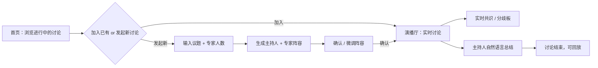

# AI Panel Studio · 产品需求文档（PRD）

> 版本：v1.0 ｜ 形态：本地 Web 应用（前后端分离）｜ 语言：中文

## 1. 背景与产品定位

**AI Panel Studio** 是一款「AI 圆桌讨论」本地 Web 应用。用户输入任意待讨论话题并指定参会专家人数（默认 4 人），系统调用大模型动态生成一组主持人 + 专家嘉宾，展示每位嘉宾的姓名、职业、Title、立场与专属颜色标识；用户确认阵容后进入演播厅，观看一场由 AI 驱动、实时推进的圆桌讨论。

**核心价值主张**：让任何人都能瞬间召集一支「虚拟智库」，围绕任意议题展开深度碰撞——主持人负责开场、追问、串联与收尾，专家之间自主「举手 / 抢答 / 补充 / 反驳」，讨论过程中持续生成共识与分歧，最终呈现一场沉浸式的 AI 圆桌实况。

## 2. 目标用户与核心诉求

| 用户群体 | 特征描述 | 核心诉求 |
| --- | --- | --- |
| 知识工作者 / 研究人员 | 需要快速对一个议题进行多角度审视，时间有限 | 在几分钟内获得来自不同视角的深度分析与争辩摘要 |
| 产品 / 决策人员 | 在方案评审或战略讨论前希望预演各方立场与潜在争议 | 用 AI 圆桌发现盲点、检验假设，提升决策质量 |
| 教育与内容创作者 | 需要将复杂议题结构化呈现给受众，追求沉浸感与叙事性 | 获得一场可录制、可回放的「虚拟专家访谈」作为内容素材 |

## 3. 用户痛点

1. **视角单一**：使用单一 AI 对话获得的分析往往立场单一，缺乏真实辩论中「对抗性思考」所带来的深度。
2. **异步割裂**：多次单独询问不同角色的 AI，上下文割裂，观点之间无法真正产生互动与碰撞。
3. **过程不可见**：AI 输出通常以最终结论呈现，缺乏「思考过程」和「观点演化」的实时感与沉浸感。
4. **议题管理混乱**：用户希望同时探索多个议题，但不同讨论的上下文、进展与结论难以并行隔离管理。

## 4. 功能范围

### 4.1 MVP 内（本期交付）

| 编号 | 功能 | 说明 |
| --- | --- | --- |
| F1 | 首页讨论列表 | 展示当前所有正在进行的讨论；用户可加入已有讨论，也可发起新讨论 |
| F2 | 嘉宾生成 | 用户输入话题与专家人数后，系统调用大模型动态生成主持人 + 专家阵容，展示姓名、职业、Title、立场、专属颜色标识 |
| F3 | 阵容确认 | 用户确认（并可微调）阵容后进入演播厅 |
| F4 | 演播厅模式 | 主持人负责开场、追问、串联与总结；专家根据当前 transcript 自主决定发言顺序（举手 / 抢答 / 补充 / 反驳），每次发言控制在 1–2 句，禁止机械式轮流发言 |
| F5 | 专家状态小窗 | 每位专家有独立小窗，实时显示运行状态（待机 / 准备发言 / 发言中）、当前关注点或公开思考摘要；**不展示真实的隐藏 chain-of-thought** |
| F6 | 实时共识与分歧 | 讨论过程中持续从发言中提炼共识与分歧，实时更新对应区域；不等讨论结束后才生成 |
| F7 | 现场 Transcript | 显示发言人姓名与职业 / Title，用与专家一致的色块区分；**不显示「举手」等内部事件** |
| F8 | 主持人总结 | 结束时主持人以自然语言进行总结，**禁止将 JSON 原文显示到页面上** |
| F9 | 多讨论并行 | 不同讨论的状态、事件流、transcript、共识与分歧必须互相隔离 |
| F10 | 实时推送 | 使用 SSE 推送状态与流式发言 |
| F11 | 自适应布局 | 中文 UI，微响应式布局；不依赖整个页面滚动，各区域在自身容器内独立滚动；超宽屏 / 普通桌面 / 窄屏均需合理分配区域 |
| F12 | 离线模拟引擎 | 未配置大模型 API Key 时，内置确定性规则引擎驱动完整讨论，保证零配置可演示、可测试 |

### 4.2 MVP 外（明确不做）

- 用户账号体系、登录鉴权、多租户
- 语音合成 / 数字人视频（本期只做文本实况）
- 讨论录制导出为视频
- 移动端原生 App
- 讨论过程中的用户插话干预（仅支持暂停 / 继续 / 结束）

## 5. 核心用户流程

## 6. 关键验收标准

1. 从首页发起新讨论 → 生成阵容 → 确认 → 演播厅开始实时讨论，全链路无需刷新页面。
2. 讨论运行中，transcript 逐条实时出现，专家状态小窗同步变化，共识 / 分歧板在讨论过程中就开始更新（而非结束时一次性生成）。
3. 页面上不出现任何原始 JSON、不出现「举手」等内部事件、不出现隐藏的 chain-of-thought。
4. 同时开启 ≥2 场讨论，两边的 transcript 与共识 / 分歧互不串台。
5. 断网 / 未配置 API Key 时，讨论仍能完整跑完（走模拟引擎）。
6. 前端产物与浏览器请求中不含任何大模型 API Key。
7. 超宽屏、普通桌面、窄屏下，页面整体不出现纵向滚动条，三个区域各自独立滚动。

## 7. 非功能性要求

- **安全**：大模型 API Key 只从后端环境变量读取，绝不进入前端产物或浏览器网络请求。
- **可维护**：前后端分离；领域模型与 LLM 调用解耦，方便替换模型供应商。
- **可测试**：核心逻辑（发言调度、共识提炼、事件隔离）必须有单元测试；主流程必须有端到端测试。
- **性能**：SSE 增量推送；讨论上下文按窗口裁剪，避免 token 无上限增长。
